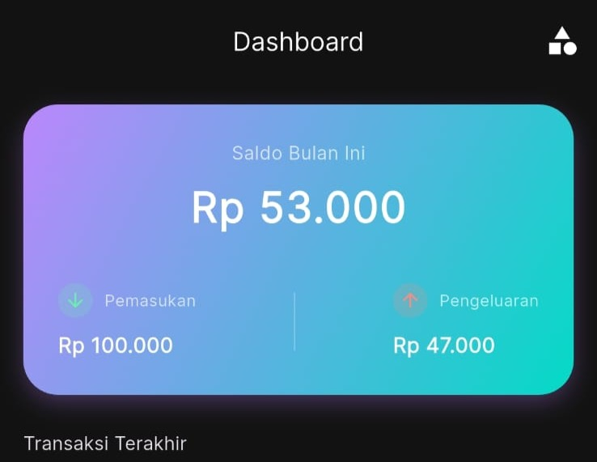
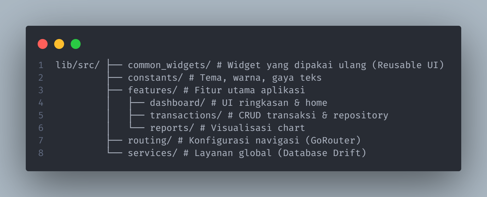
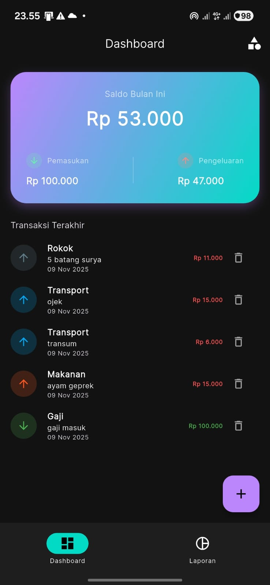
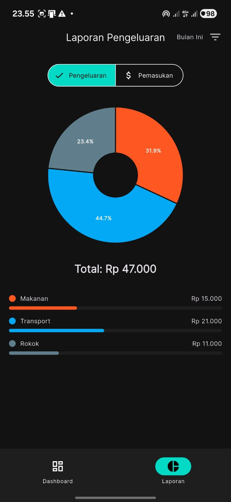

# Expense Tracker Portfolio App 💰# Expense Tracker Portfolio App 💰

Aplikasi manajemen keuangan pribadi yang dibangun dengan Flutter. Proyek ini mendemonstrasikan penerapan arsitektur modern, *clean code*, manajemen *state* yang reaktif, dan pengujian otomatis.


*(Tip: Ganti ini dengan gambar banner menarik atau kolase screenshot aplikasimu)*

## ✨ Fitur Unggulan

### 📱 Inti & UI/UX
* **Dashboard Interaktif:** Ringkasan saldo real-time dengan animasi angka yang menarik.
* **Manajemen Transaksi (CRUD Lengkap):** Tambah, lihat, edit, dan hapus transaksi dengan mudah.
* **Kategori Kustom:** Pengguna dapat membuat kategori sendiri dengan pilihan warna dan ikon.
* **Animasi Halus:** Menggunakan `flutter_animate` untuk transisi daftar dan grafik yang hidup.

### 📊 Laporan & Analisis
* **Visualisasi Data:** Pie Chart interaktif untuk melihat proporsi pengeluaran/pemasukan.
* **Filter Laporan:** Analisis berdasarkan periode waktu (Bulan Ini, Tahun Ini, dll.).
* **Toggle Pemasukan/Pengeluaran:** Beralih tampilan laporan dengan cepat.

### ⚙️ Teknis & Arsitektur
* **Database Lokal Kuat:** Menggunakan **Drift (SQLite)** untuk penyimpanan data offline yang persisten.
* **State Management Modern:** Menggunakan **Riverpod** untuk manajemen state yang testable dan scalable.
* **Automated Testing:** Unit test untuk memastikan logika bisnis di layer repository berjalan benar.
* **Clean Architecture:** Struktur folder berbasis fitur (*Feature-First*) yang terorganisir.

## 🛠 Tech Stack

| Kategori | Teknologi/Paket |
| :--- | :--- |
| **Framework** | Flutter (Dart) |
| **State Management** | `flutter_riverpod` |
| **Database** | `drift`, `sqlite3` |
| **Navigation** | `go_router` |
| **UI/Animations** | `fl_chart`, `flutter_animate`, `google_fonts`, `flutter_svg` |
| **Utils** | `intl` (DateFormat & Currency) |
| **Testing** | `flutter_test`, `drift` (in-memory) |

## 📂 Struktur Proyek
Proyek ini menggunakan pendekatan **Feature-First Layered Architecture**:


## 🚀 Cara Menjalankan

1.  **Clone repositori ini:**
    ```bash
    git clone [https://github.com/username-kamu/expense_tracker.git](https://github.com/username-kamu/expense_tracker.git)
    ```
2.  **Install dependensi:**
    ```bash
    flutter pub get
    ```
3.  **Generate file database:**
    ```bash
    dart run build_runner build --delete-conflicting-outputs
    ```
4.  **Jalankan aplikasi:**
    ```bash
    flutter run
    ```

## 🧪 Menjalankan Test
Untuk memverifikasi logika database:
```bash
flutter test
```

## 📸 Screenshots

 | 